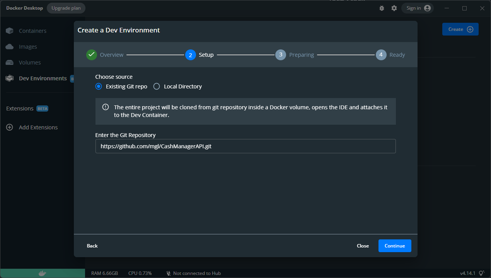
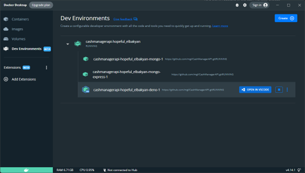

https://img.shields.io/github/workflow/status/mgl/CashManagerAPI/Deno%20CI https://img.shields.io/github/workflow/status/mgl/CashManagerAPI/Deno%20CD?label=deployment

# CashManagerAPI

This is the API Backend of the Cash Manager project.

## Technical Docs

[Documentation](/docs)

## Tech Stack

[Deno](https://deno.land) + [Oak](https://oakserver.github.io/oak) +
[MongoDB](https://www.mongodb.com)

## CI/CD

The API is deployed on [Scaleway](https://www.scaleway.com/en/): (https://cashmanagerfggvocmz-cashmanagerapi.functions.fnc.fr-par.scw.cloud)

This project uses [Github Actions](.github/workflows) to build and deploy the [Docker image](Dockerfile)

## Get started

If you just want to start the server:

> docker compose up

### Develop using [Docker Dev](https://docs.docker.com/desktop/dev-environments)

Clone and open the Deno container:

Run the project:

> deno run --allow-net --allow-env --watch src/server.ts

A Mongo Express interface is available at
[http://localhost:8081](http://localhost:8081/)

### Error when using Git

Sometimes there is an error with Git regarding the repository ownership:

> fatal: detected dubious ownership in repository at
> '/com.docker.devenvironments.code'

To fix it:

> git config --global --add safe.directory /com.docker.devenvironments.code
