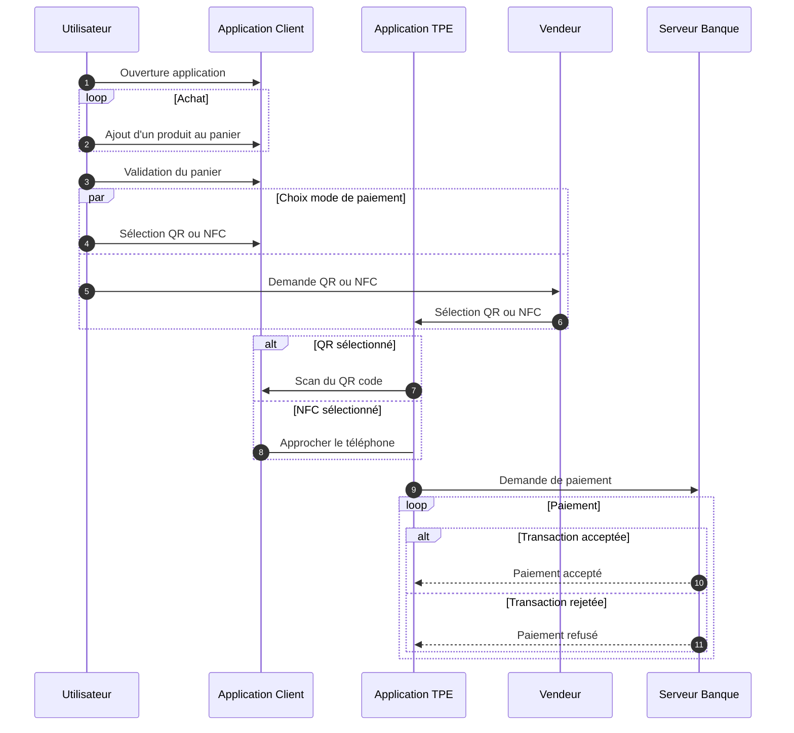
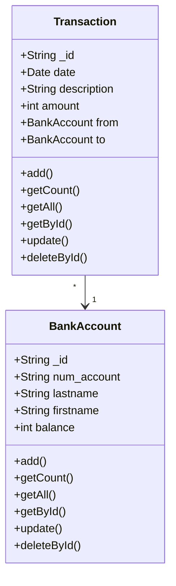

# Documentation

## Diagramme de séquence

```mermaid
sequenceDiagram
    participant A as Utilisateur
    participant B as Application Client
    participant C as Application TPE
    participant D as Vendeur
    participant E as Serveur Banque

    autonumber

    A->>B: Ouverture application
    loop Achat
        A->>B: Ajout d'un produit au panier
    end
    A->>B: Validation du panier
    par Choix mode de paiement
    A->>B: Sélection QR ou NFC
    and
    A->>D: Demande QR ou NFC
    D->>C: Sélection QR ou NFC
    end
    alt QR sélectionné
        C->>B: Scan du QR code
    else NFC sélectionné
        B->C: Approcher le téléphone
    end
    C->>E: Demande de paiement
    loop Paiement
        alt Transaction acceptée
            E-->>C: Paiement accepté
        else Transaction rejetée
            E-->>C: Paiement refusé
        end
    end
```

## Diagramme de classe

```mermaid
classDiagram
    class BankAccount{
        +String _id
        +String num_account
        +String lastname
        +String firstname
        +int balance
        +add()
        +getCount()
        +getAll()
        +getById()
        +update()
        +deleteById()
    }

    class Transaction{
        +String _id
        +Date date
        +String description
        +int amount
        +BankAccount from
        +BankAccount to

        +add()
        +getCount()
        +getAll()
        +getById()
        +update()
        +deleteById()
    }

    Transaction "*" --> "1" BankAccount
```
